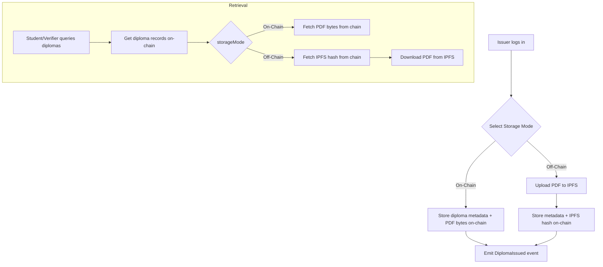

## Diploma Provisioning and Verification System Requirements

This document outlines the detailed requirements for a smart contract-based diploma provisioning system supporting both on-chain and off-chain storage options. It includes functional and non-functional requirements, roles and permissions, data model, and a flow diagram illustrating the end-to-end process.

---

### 1. Actors and Roles

- **Issuer**: Entity authorized to issue diplomas.
- **Student**: Recipient of diplomas who can view their diplomas.
- **Verifier**: Any user who can verify the validity of diplomas.
- **System**: Smart contract and off-chain infrastructure (IPFS).

---

### 2. Functional Requirements

1. **Authentication & Authorization**

   - Issuer must authenticate (via wallet signature) to access issuance functions.
   - Role-based access control enforced on-chain:
     - `ISSUER_ROLE`: Can issue diplomas and configure storage mode.
     - `VIEWER_ROLE`: Default for students and verifiers for read-only operations.

2. **Storage Mode Selection (Issuer)**

   - Upon login, issuer can select storage mode for each diploma:
     - **On-Chain Mode**: Diploma metadata and PDF stored fully on-chain.
     - **Off-Chain Mode**: PDF stored on IPFS; only hash and metadata stored on-chain.
   - Storage mode persisted per-diploma in smart contract state.

3. **Diploma Issuance**

   - Input: Student address, diploma ID, metadata (e.g., degree, date), PDF data.
   - If **On-Chain**:
     - Store PDF bytes directly in smart contract storage (with size limits or chunking).
     - Emit `DiplomaIssued` event with `storageMode = ON_CHAIN`.
   - If **Off-Chain**:
     - Upload PDF to IPFS; obtain `ipfsHash`.
     - Store `ipfsHash` and metadata on-chain.
     - Emit `DiplomaIssued` event with `storageMode = OFF_CHAIN`.

4. **Diploma Retrieval (Student & Verifier)**

   - Query smart contract for diplomas by student address.
   - For each diploma:
     - If **On-Chain**, retrieve PDF bytes directly from chain.
     - If **Off-Chain**, retrieve `ipfsHash` from chain and fetch PDF from IPFS gateway.
   - Display metadata and link or render PDF.

5. **Diploma Verification**

   - Input: Diploma ID or hash.
   - Smart contract verifies existence and storage mode.
   - Returns issuance status, metadata, and PDF location (on-chain data or IPFS hash).

---

### 3. Data Model

| Field       | Type      | Description                                |
| ----------- | --------- | ------------------------------------------ |
| diplomaId   | `bytes32` | Unique identifier (e.g., hash of metadata) |
| student     | `address` | Blockchain address of student              |
| issuedAt    | `uint256` | Timestamp of issuance                      |
| metadata    | `string`  | JSON string with degree, date, etc.        |
| storageMode | `enum`    | `ON_CHAIN` or `OFF_CHAIN`                  |
| pdfOnChain  | `bytes`   | Raw PDF bytes (if on-chain)                |
| ipfsHash    | `string`  | IPFS CID (if off-chain)                    |

---

### 4. Non-Functional Requirements

- **Scalability**: Support up to X diplomas without performance degradation.
- **Cost Optimization**: Off-chain mode to minimize gas costs.
- **Security**:
  - Smart contract must be audited.
  - IPFS uploads verified via hash matching on-chain.
- **Usability**: Clear UI for issuers to select storage mode and view storage cost estimates.
- **Transparency**: All issuance and verification events logged on-chain.

---

### 5. Flow Diagram

---

*Version*: 1.0\
*Date*: 2025-07-16

